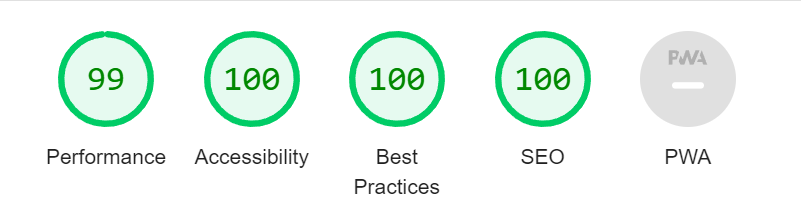

# Pig Game - JavaScript Game

The creation of this JavaScript Game is part of the Udemy course ["The Complete JavaScript Course 2022: From Zero to Expert!"](https://www.udemy.com/course/the-complete-javascript-course/)

[Live Preview](https://ralitsavoronevska.github.io/pig-game/)

[CodePen](https://codepen.io/ralitsavoronevska/pen/LYQQyBL)

# Desktop Preview:

# Tablet Landscape Preview:

<table>
  <tr>
    <td colspan="2">Tablet Portrait Preview</td>
  </tr>
  <tr>
    <td></td>
    <td></td>
  </tr>
 </table>

<table>
  <tr>
    <td colspan="2">Mobile Preview</td>
  </tr>
  <tr>
    <td></td>
    <td></td>
  </tr>
 </table>

# Built with:

- HTML5, CSS3, SASS, Vanilla JS

# Browser support:

(Last updated and tested: 29/05/2022)

- Chrome 102.0.5005.61 (Official Build) (64-bit)
- Firefox 100.0.2 (64-bit)
- Opera 87.0.4390.36
- IE Microsoft Edge 101.0.1210.53 (Official build) (64-bit)

# Tools used:

- [W3C HTML Validator](https://validator.w3.org/)
- [W3C CSS Validator](https://jigsaw.w3.org/css-validator/)
- [LightHouse Audit](https://developers.google.com/web/tools/lighthouse/)
- [PageSpeed Insights Audit](https://developers.google.com/speed/pagespeed/insights/)

# Chrome LightHouse Audit

- Desktop:
  

- Mobile:
  

# PageSpeed Insights Results

- Desktop:
  

- Mobile:
  
